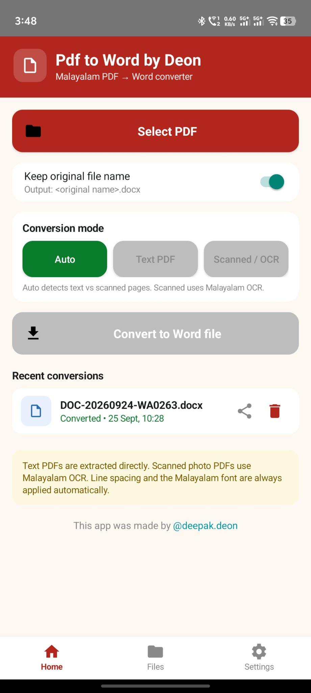
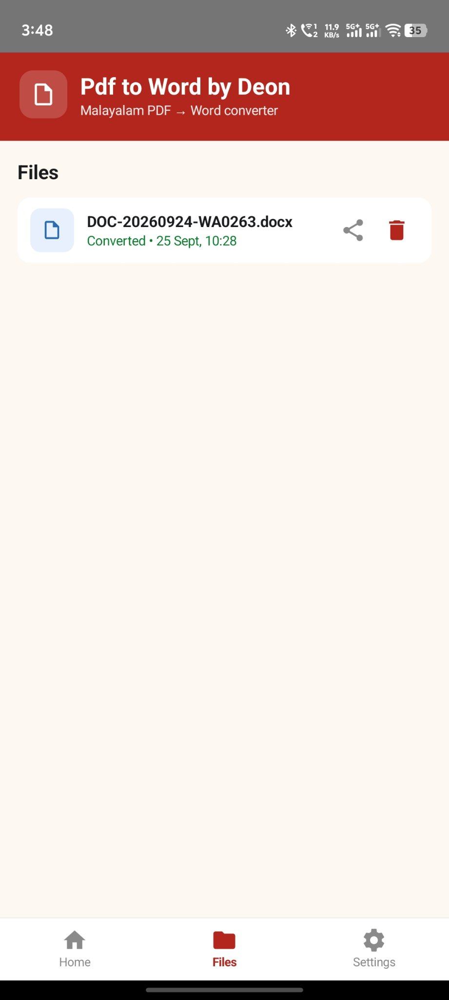
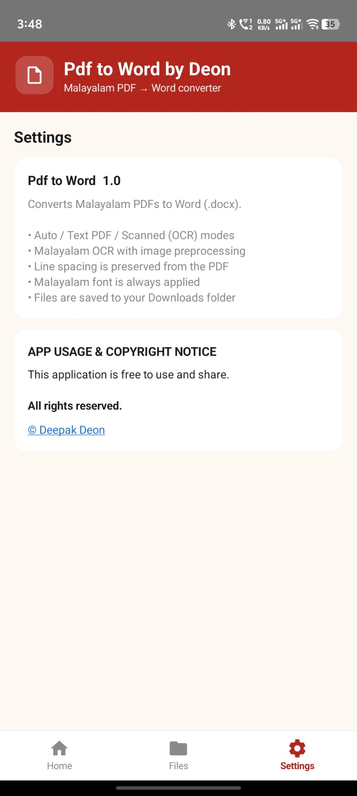

# Pdf to Word by Deon

An Android app that converts Malayalam PDFs to Word (`.docx`) files — made simple, made local.

## Features

- 📄 Converts text-based Malayalam PDFs to `.docx`
- ✍️ Preserves line spacing from the original PDF
- 🔤 Malayalam font is always applied automatically
- 📥 Converted files are saved to your Downloads folder
- 📊 Live conversion progress bar (1% → 100%)
- 📂 Files tab to browse your converted documents
- ⚙️ Settings with app info and copyright notice

## Screenshots

| Home | Files | Settings |
|------|-------|----------|
|  |  |  |

## How it works

Pick a PDF from your device → the app extracts its text page by page → applies a Malayalam font and the original line spacing → saves a `.docx` file to Downloads.

> ⚠️ Only **text-based PDFs** are supported — scanned/image-only PDFs won't convert.

## Build it yourself

Open in Android Studio and hit **Run**, or build from the terminal:

```bash
bash offline-build.sh clean assembleDebug
```

The APK lands in `app/build/outputs/apk/debug/`.

## License

Free to use and share. All rights reserved — © Deepak Deon.
